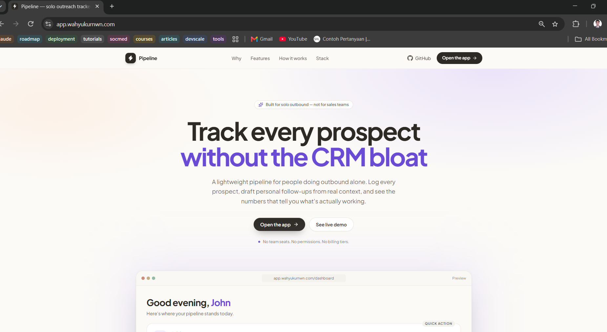
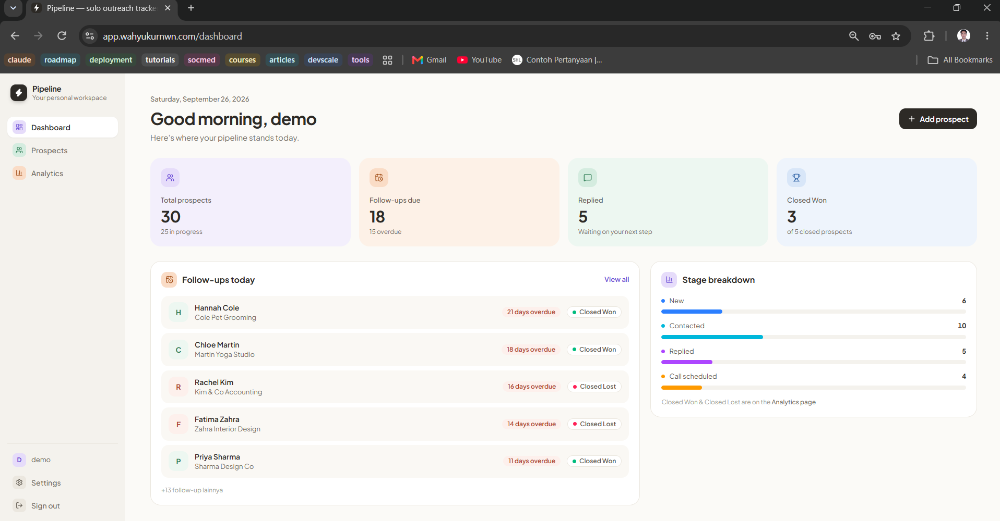
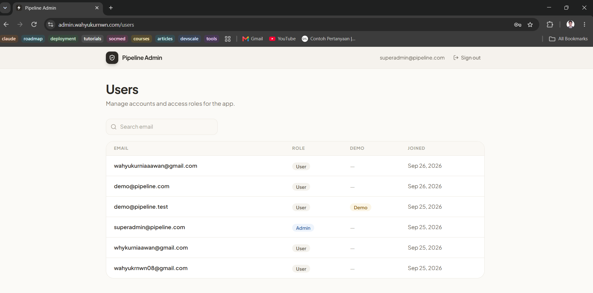
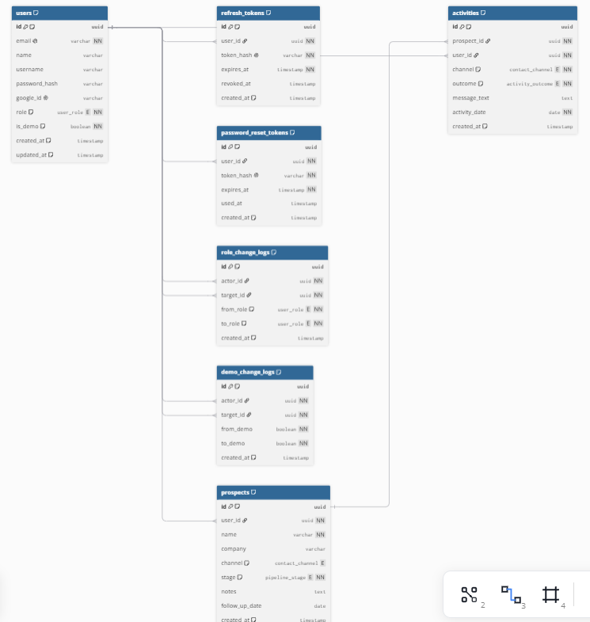
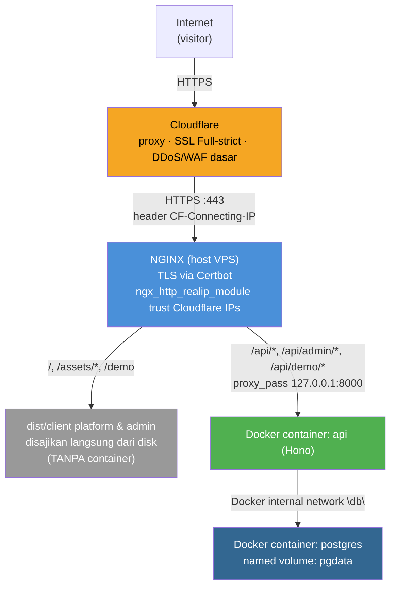

## 1. Product Overview

**Apa:** Pipeline tracker ringan + drafting pesan outreach berbantuan AI + analitik konversi sederhana, dibuat khusus untuk satu orang yang melakukan outbound sendirian — bukan tim sales.

**Untuk siapa:** Freelancer, konsultan solo, atau independent professional yang mencari klien atau pekerjaan sendiri. Primary user MVP adalah pembuatnya sendiri.

**Masalah yang diselesaikan:** Orang yang outbound sendirian biasanya terjebak di dua ekstrem: spreadsheet manual (tanpa bantuan drafting, tanpa analitik) atau CRM tim yang terlalu berat untuk satu orang.

**Value proposition:** Satu tempat untuk melacak prospek, menulis pesan personal dibantu AI, dan membaca angka konversi yang jujur.

**Pitch 5–10 detik:** "Pipeline sederhana untuk satu orang — lacak prospek, draft pesan personal dengan AI, lihat apa yang benar-benar berhasil."




**Status dokumen (26 September 2026):** Project ini **sudah live di production** — `https://app.wahyukurnwn.com` (platform), `https://admin.wahyukurnwn.com` (admin), `https://api.wahyukurnwn.com` (API), domain sungguhan (`wahyukurnwn.com`) dengan DNS+proxy Cloudflare, HTTPS via Let's Encrypt, deploy otomatis lewat GitHub Actions setiap push ke `main`, backup database terjadwal, dan seluruh 5 gap kualitas yang tercatat di draft PRD sebelumnya (anti-fabrikasi prompt AI, konteks aktivitas terakhir, peringatan catatan kosong, validasi tanggal masa depan, pembersihan skema `Tag`/`ProspectTag` yang tidak terpakai) sudah selesai dikerjakan dan diverifikasi. Setiap komponen di bagian teknis tetap diberi status **Sudah ada**, **Direncanakan**, atau **Belum ada**, supaya dokumen ini tidak menyatakan sesuatu yang belum benar — sisa yang belum ada sekarang murni: validasi user eksternal (materi sudah disiapkan, belum dikirim/belum ada hasil), screenshot README, dan item observability/roadmap besar yang memang sengaja ditunda.

**Cara memakai dokumen ini.** *Who:* satu orang yang memegang tiga peran (product, design, engineering) dengan tanggung jawab yang tetap dibedakan. *When:* dibaca sebelum menambah fitur, dan diperbarui saat requirement berubah signifikan. *Output:* source of truth untuk scope, requirement, prioritas, dan hasil yang diharapkan. *Mencegah:* scope creep, requirement yang ambigu, dan usaha engineering yang terbuang.

---

## 2. Problem Statement

**Kondisi saat ini.** Orang yang outbound sendirian melacak prospek dengan spreadsheet + email manual sebagai pipeline ad hoc, menulis pesan dari nol tiap kali, dan mengingat follow-up di kepala.

**Pain point utama dan statusnya**

| Pain point | Status |
|---|---|
| Follow-up mudah terlupakan | **Validated** — dialami langsung oleh pembuatnya saat mencari pekerjaan/klien (N=1) |
| Menulis pesan outreach berulang dari nol memakan waktu | **Validated** — N=1 |
| Tidak ada visibilitas data soal efektivitas outreach | **Validated** — N=1 |
| Freelancer lain mengalami pola yang sama dan mau memakai tool ini | **Assumption** — belum diuji |
| Model channel Email/LinkedIn/Telepon cocok untuk cara freelancer lain mendapat klien | **Open Question** — di banyak pasar lokal, calon klien lebih sering datang lewat WhatsApp, DM Instagram, dan rekomendasi |

**Inefisiensi yang terjadi:** waktu terbuang menulis ulang pesan yang mirip, follow-up hilang begitu saja, dan iterasi pesan tidak berbasis data.

**Mengapa layak diselesaikan.** Outbound adalah salah satu channel dengan biaya per lead terendah untuk operator solo, tetapi tooling yang buruk membuat eksekusinya tidak konsisten. Ini penalaran, bukan data.

**Penting — jangan disamakan:** yang tervalidasi adalah **problem validation pada diri sendiri (N=1)**, bukan **product-market validation pada user lain**. Validasi user lain adalah tahap berikutnya (bagian 13), bukan syarat untuk membangun MVP.

---

## 3. Target Users

- **Primary user:** pembuatnya sendiri, sebagai freelancer/independent professional. **Validated** (N=1).
- **Secondary user:** freelancer solo lain dengan pola kerja serupa, dan kelompok penguji kecil (kurang lebih 30 orang, termasuk teman dan kenalan). **Assumption**.
- **Audience tambahan:** rekruter dan pemberi kerja yang menilai repository ini sebagai portofolio. Ini memengaruhi keputusan seperti antarmuka berbahasa Inggris, akun demo publik, dan dokumentasi.
- **User context:** bekerja sendiri, tidak ada tim, mengelola puluhan (bukan ribuan) prospek pada satu waktu, memakai laptop.
- **Jobs-to-be-done:** "Saat saya menemukan calon klien baru, saya ingin mencatatnya dan tahu langkah berikutnya, tanpa harus mengingat semuanya di kepala atau mencari-cari di spreadsheet."
- **Primary use cases:** tambah prospek → catat interaksi outreach → dapatkan draft pesan follow-up → lihat prospek yang butuh tindakan hari ini → sesekali tinjau angka konversi.

---

## 4. Goals & Objectives

- **Tujuan utama (Decision):** menyelesaikan loop ide → MVP → deploy → dipakai nyata → evaluasi → iterasi, tanpa macet. Menyelesaikan loop ini lebih penting daripada kelengkapan fitur.
- **Tujuan kedua:** menghasilkan artifact portofolio yang kredibel untuk kombinasi SWE + Systems/Ops + Sales: keputusan teknis yang terdokumentasi dan keterbatasan yang diakui secara jujur.
- **Tujuan ketiga (bonus, bukan syarat):** benar-benar dipakai untuk outreach nyata.
- **Decision:** antarmuka produk berbahasa Inggris, karena audience portofolio mencakup rekruter dan pemberi kerja internasional.
- **Posisi saat ini:** tahap "membangun MVP" dan "deploy" sudah selesai — aplikasi live di production. Sisa pekerjaan ada di validasi pemakaian nyata (bagian 13) dan iterasi berdasarkan umpan baliknya.

---

## 5. Value Proposition

**Dibanding spreadsheet:** drafting pesan kontekstual, daftar follow-up terstruktur, dan angka konversi otomatis.
**Dibanding CRM tim (HubSpot dkk.):** tidak ada kompleksitas permission, tim, dan billing yang tidak relevan untuk satu orang.
**Diferensiator kecil tapi nyata:** angka dihitung dari riwayat aktivitas dengan definisi eksplisit dan peringatan sampel kecil, bukan angka yang terlihat pasti padahal datanya sedikit.

**Rantai Problem → Desired Outcome → Solution → Feature**

| Problem | Desired outcome | Solution | Feature |
|---|---|---|---|
| Follow-up terlupa | Tidak ada prospek yang terlewat | Daftar "perlu tindakan hari ini" | Tanggal follow-up + kartu follow-up di dashboard |
| Pesan ditulis dari nol | Titik awal yang personal dalam hitungan detik | Draft dari data prospek yang tersimpan | Draft AI dari nama, perusahaan, channel, stage, catatan |
| Tidak tahu apa yang berhasil | Keputusan berbasis angka yang jujur | Metrik dihitung dari riwayat aktivitas | Analitik response rate dan conversion rate |
| Kehilangan jejak siapa yang sudah dihubungi | Satu sumber kebenaran | Prospek + stage + riwayat aktivitas | Prospect CRUD, pipeline stage, activity log |

---

## 6. User Stories

Format: **As a [ROLE], I want to [ACTION], so that [GOAL].**

**1. As a freelancer, I want to add a new prospect with basic context, so that I don't lose track of who I've contacted.**
- *Preconditions:* user sudah login.
- *Acceptance criteria:* form menyimpan nama, perusahaan, channel, stage, tanggal follow-up, dan catatan bebas; prospek baru default ke stage "New".
- *Edge case:* nama kosong ditolak dengan pesan error yang jelas (validasi Zod, response 422).

**2. As a freelancer, I want to log an outreach activity for a prospect, so that I have a history of what I've done.**
- *Acceptance criteria:* aktivitas tersimpan dengan tanggal, channel, hasil (sent / replied / no response), dan opsional teks pesan; riwayat tampil kronologis; aktivitas dapat diedit dan dihapus.
- *Edge case:* tanggal di masa depan ditolak. **Status:** sudah ditegakkan (`activity.schema.ts`, batas toleransi "besok UTC" agar user di zona WIB/UTC+7 tidak salah tertolak untuk entri hari yang sama), berlaku untuk create maupun update.

**3. As a freelancer, I want to see which prospects are due for follow-up today, so that nothing falls through the cracks.**
- *Acceptance criteria:* kartu "follow-ups today" menampilkan prospek dengan follow-up date ≤ hari ini, diurutkan dari yang paling lama tertunda.
- *Expected behavior:* "hari ini" ditentukan dari **tanggal lokal user** yang dikirim client, bukan jam server. Ini memperbaiki bug: follow-up yang jatuh tempo hari ini tidak muncul selama beberapa jam pertama di zona UTC+.

**4. As a freelancer, I want an AI-drafted message based on a prospect's context, so that I don't write from scratch every time.**
- *Acceptance criteria:* draft dibuat dari data yang tersimpan di prospek; **selalu** tampil sebagai teks yang bisa diedit; **tidak pernah** terkirim otomatis; tidak ada yang disimpan kecuali user menyimpan aktivitasnya.
- *Error case:* provider AI lambat, penuh, atau tidak tersedia menghasilkan pesan yang jelas dan bisa dicoba ulang, bukan error server generik.
- **Status:** semua gap yang sebelumnya tercatat sudah ditutup — (a) prompt berisi instruksi eksplisit anti-fabrikasi ("hanya pakai fakta yang diberikan, jangan mengarang detail/angka/janji di luar catatan dan riwayat aktivitas"); (b) hingga 3 aktivitas terakhir (tanggal, channel, hasil, cuplikan pesan) ikut jadi konteks prompt; (c) UI menampilkan peringatan "This prospect has no notes yet" di dekat tombol Draft with AI saat catatan prospek kosong, mengarahkan user ke dialog Edit.

**5. As a freelancer, I want to see my response rate and conversion rate, so that I know if my approach is working.**
- *Acceptance criteria:* angka dihitung live dari riwayat aktivitas, bukan tabel agregat; bila belum ada prospek yang dihubungi tampil "—", bukan "0%"; ada catatan bila sampel di bawah 30.

**6. As a user, I want to sign up and sign in with email + password or Google, and recover a forgotten password by email, so that my data stays private to me.**
- *Acceptance criteria:* sesi memakai access token berumur pendek + refresh token yang dirotasi; sign-out mencabut sesi di server; respons lupa-password identik untuk email terdaftar maupun tidak.
- *Edge case:* percobaan berulang dibatasi per IP (sign-up, sign-in, lupa-password).

**7. As a user, I want to manage how I sign in (change/remove password, link/unlink Google), so that I stay in control of my account.**
- *Acceptance criteria:* akun tidak boleh kehilangan semua cara masuk; menghapus metode terakhir ditolak.

**8. As a visitor, I want to explore the product with sample data without signing up, so that I can judge it first.**
- *Acceptance criteria:* halaman `/demo` bersifat read-only dan memakai satu akun demo yang dipilih server; client tidak pernah mengirim user id.

**9. As an admin, I want to manage roles and choose the public demo account, so that access is controlled and changes are traceable.**
- *Acceptance criteria:* setiap perubahan role dan status demo tercatat (siapa mengubah akun siapa, dari apa ke apa, kapan); perubahan yang tidak mengubah nilai tidak dicatat.

---

## 7. Functional Requirements

- **Prospect management:** create, read, update, delete prospek (nama, perusahaan, channel, stage, catatan, tanggal follow-up). Menghapus prospek ikut menghapus riwayat aktivitasnya dalam satu transaksi.
- **Pipeline stages:** New → Contacted → Replied → Call Scheduled → Closed Won / Closed Lost. **Decision:** perpindahan bebas antar-stage, tanpa state machine, karena aturan kaku di sini overengineering untuk keputusan yang dibuat manual oleh satu orang.
- **Outreach tracking:** log per aktivitas (tanggal, channel, hasil, opsional teks pesan); dapat diedit dan dihapus.
- **Follow-up scheduling:** field tanggal follow-up dan daftar due/overdue yang dihitung dari tanggal lokal user. Bukan notifikasi push.
- **Activity history:** daftar kronologis aktivitas per prospek.
- **Search & filtering:** cari berdasarkan nama/perusahaan, filter berdasarkan stage.
- **Notes:** catatan bebas per prospek. Ini input penting untuk drafting AI, bukan pelengkap.
- **Basic analytics:** total per stage, response rate, conversion rate, dan breakdown per channel, dihitung on-the-fly. *Response rate* = prospek dengan minimal satu aktivitas "replied" ÷ prospek dengan minimal satu aktivitas. *Conversion rate* = prospek Closed Won yang pernah dihubungi ÷ prospek dengan minimal satu aktivitas, sehingga tidak bisa melebihi 100%.
- **AI-assisted drafting:** `POST /api/prospects/:id/draft`; stateless; rate limit per user; tidak ada pengiriman otomatis.
- **Authentication & account:** sign-up/sign-in email + password, Google OAuth (opsional), lupa/reset password lewat email, ganti/hapus password, lepas Google, `GET /api/auth/me`.
- **Public demo:** `/api/demo/*` (prospek, aktivitas, follow-up, analitik) read-only tanpa autentikasi.
- **Admin console (`apps/admin`):** daftar dan pencarian user, ubah role, tandai akun demo, riwayat audit perubahan role dan status demo.


- **Health endpoint:** `GET /health` untuk Docker `HEALTHCHECK` dan verifikasi deploy; mengecek koneksi database (`SELECT 1`) dan menjawab 503 bila database tidak terjangkau, bukan cuma menandakan proses hidup. **Status:** sudah ada (`apps/api/src/app.ts`, diuji di `health.test.ts`), tanpa autentikasi dan tanpa business logic.

---

## 8. Non-Functional Requirements

Untuk MVP, hanya requirement yang benar-benar relevan dipenuhi. Sisanya sengaja tidak dikejar.

- **Security.** Password di-hash dengan bcrypt. Access token JWT berumur 15 menit; refresh token acak (disimpan hanya sebagai hash SHA-256) berumur 30 hari, dirotasi tiap dipakai, dan dicabut saat sign-out; dikirim lewat cookie `httpOnly`, `SameSite=Lax`, `Secure` di production, dengan path `/api/auth`. Data di-scope per `user_id`, dan mengakses data orang lain menghasilkan 404, bukan 403, supaya keberadaan data tidak terkonfirmasi. Endpoint auth dibatasi per IP. Kode tukar Google sekali pakai berumur 60 detik, sehingga token tidak pernah ada di URL. Link reset password dibangun server dari peta origin tepercaya, bukan dari header `Origin`. HTTPS menjadi tanggung jawab reverse proxy.
- **Performance.** **Decision:** bukan prioritas MVP. Skala data puluhan sampai ratusan prospek tidak butuh optimasi.
- **Reliability.** **Decision:** best-effort. Error dari provider eksternal (AI, email) diubah menjadi pesan yang jelas, dan penyebab aslinya dicatat ke log.
- **Availability.** **Decision:** tidak ada target SLA. Satu VM tanpa failover otomatis atau deploy tanpa downtime adalah trade-off yang diterima sadar untuk MVP.
- **Scalability.** **Decision:** bukan requirement MVP. Konsekuensi teknis yang dicatat: rate limiter dan kode tukar OAuth disimpan di memori proses, jadi cukup untuk satu instance API dan perlu Redis atau sejenisnya bila lebih dari satu.
- **Maintainability.** Prioritas tinggi: pemisahan route → service → repository, tipe kontrak API dibagi lewat Hono RPC, test integrasi terhadap PostgreSQL sungguhan, Biome + Husky, README, dan keputusan arsitektur terdokumentasi.
- **Observability.** Log stdout container dan endpoint health cukup untuk MVP. Error tracking direkomendasikan, tidak wajib.
- **Data privacy.** Akun demo hanya berisi data contoh. Email disamarkan di UI (sidebar menampilkan bagian lokal saja; pengaturan akun menampilkan format tersamarkan). UI memperingatkan bahwa draft AI diproses pihak ketiga dan catatan tidak boleh berisi data sensitif.
- **Backup / recovery.** PostgreSQL berjalan sebagai container di VM (named volume, bukan BaaS — lihat bagian 16, Decision change 23 September 2026), jadi backup **bukan** tanggung jawab penyedia eksternal lagi; perlu `pg_dump` terjadwal sendiri (**belum ada**, dicatat sebagai gap). Server aplikasi (`api`) tetap stateless: "pemulihan"-nya adalah redeploy dari git + secrets, terpisah dari pemulihan data.
- **Testability.** Test berjalan terhadap database terpisah (`<nama>_test`) yang dibuat dan dimigrasi otomatis, dengan pengaman yang menolak berjalan ke database yang namanya tidak berakhiran `_test`.

---

## 9. Feature Prioritization

Prinsip: fitur tidak masuk MVP hanya karena menarik secara teknis.

### Key Features — MVP

| Fitur | Problem | User | Expected value | Complexity | Dependency | Wajib MVP | Status |
|---|---|---|---|---|---|---|---|
| Prospect CRUD | Kehilangan jejak siapa yang sudah dihubungi | Freelancer | Tinggi | Rendah | Auth | Ya | Sudah ada |
| Pipeline stage (bebas pindah) | Tidak tahu status tiap prospek | Freelancer | Tinggi | Rendah | Prospect CRUD | Ya | Sudah ada |
| Activity logging | Tidak ada riwayat interaksi | Freelancer | Tinggi | Rendah | Prospect CRUD | Ya | Sudah ada |
| Follow-up due list | Follow-up terlupa | Freelancer | Tinggi | Rendah | Prospect CRUD | Ya | Sudah ada |
| Notes per prospek | Konteks hilang; input AI | Freelancer | Tinggi | Rendah | Prospect CRUD | Ya | Sudah ada |
| AI-assisted drafting | Menulis dari nol | Freelancer | Tinggi | Sedang | Notes, layanan AI | Ya (diferensiator) | Sudah ada; prompt anti-fabrikasi + konteks aktivitas terakhir (bagian 6) |
| Basic analytics | Tidak tahu apa yang berhasil | Freelancer | Sedang-tinggi | Rendah | Activity logging | Ya | Sudah ada |
| Auth email + password + reset password | Data harus privat per user | Semua | Tinggi | Sedang | Layanan email (Resend) | Ya | Sudah ada, domain email terverifikasi (bukan sandbox lagi) |
| Health endpoint | Verifikasi container dan deploy | Operator | Sedang | Rendah | — | Ya (untuk deploy) | Sudah ada, dipakai `HEALTHCHECK` Docker dan CD |

### Nice-to-Have

| Fitur | Problem | User | Expected value | Complexity | Dependency | Wajib MVP | Status |
|---|---|---|---|---|---|---|---|
| Search & filter | Nyaman di skala lebih besar | Freelancer | Rendah-sedang | Rendah | Prospect CRUD | Tidak | Sudah ada |
| Google sign-in | Masuk tanpa mengingat password | User | Sedang | Sedang | Kredensial Google | Tidak | Sudah ada (opsional) |
| Pengaturan akun (ganti/hapus password, lepas Google) | Kontrol atas cara masuk | User | Sedang | Sedang | Auth | Tidak | Sudah ada |
| Akun demo publik read-only | Mencoba produk tanpa daftar; portofolio | Pengunjung | Sedang | Rendah | Akun demo | Tidak | Sudah ada |
| Admin console + audit log | Kontrol role dan jejak perubahan | Admin | Sedang | Sedang | Auth, role | Tidak | Sudah ada |
| Import CSV | Mempercepat migrasi data lama | Freelancer | Sedang | Sedang | Prospect CRUD | Tidak | Belum ada |

**Catatan:** tabel `Tag`/`ProspectTag` sempat ada di skema database tapi tidak pernah dipakai API/UI, dan dihapus 25 September 2026 (lihat `ERD.md`) karena tidak ada bukti kebutuhan nyata. Kalau tagging benar-benar dibutuhkan nanti, didesain ulang dari nol berdasarkan kebutuhan yang tervalidasi, bukan restore skema lama.

### Planned / Future Features

| Fitur | Alasan ditunda | Syarat sebelum dibangun |
|---|---|---|
| Channel WhatsApp + tombol "kirim via WhatsApp" dengan draft AI terisi | Relevan bila validasi user lain menunjukkan WhatsApp channel utama | Hasil Tahap 3 (bagian 13) |
| Pengingat di luar aplikasi (email/push) | Follow-up saat ini hanya terlihat saat aplikasi dibuka | Terbukti sering terlewat walau ada daftar in-app |
| UI daftar sesi dan pencabutan sesi perangkat lain | Sign-out sudah mencabut sesi yang dipakai | Setelah MVP |
| Multi-user/team, kirim email/LinkedIn otomatis, dashboard chart, i18n | Tidak relevan untuk satu user dan kompleksitas tinggi | Traksi nyata |

---

## 10. MVP Scope

**Definisi (Decision):** prospect CRUD, pipeline stage, activity logging, follow-up due list, notes, AI-assisted drafting (draft-only), analitik numerik dasar, auth self-managed, dan health endpoint. Dibangun sebagai monorepo dengan frontend dan backend terpisah.

**Status implementasi:** semuanya sudah dibangun, diuji (107 test integrasi terhadap PostgreSQL sungguhan), dan **live di production** — `https://app.wahyukurnwn.com`, `https://admin.wahyukurnwn.com`, `https://api.wahyukurnwn.com`.

**Melampaui scope awal (jujur).** Akun demo publik, admin console, audit log, rate limiting, dan rotasi refresh token tidak dibutuhkan oleh tool untuk satu pengguna. Semuanya ditambahkan karena mendukung tujuan portofolio dan karena auth self-managed membutuhkan kontrol sesi yang layak. Ini persis pola yang PRD ini coba cegah (bagian 18): scope bertambah sebelum loop inti terbukti. Tidak ada tambahan lagi sebelum evaluasi Tahap 3 (bagian 13) selesai.

**Realistis untuk solo developer:** seluruh loop ide → MVP → deploy sudah selesai dalam satu putaran solo, termasuk infrastruktur (VM, domain, TLS, CI/CD, backup). Sisa pekerjaan sekarang murni product-market validation, bukan lagi engineering.

---

## 11. Out of Scope

Sengaja tidak dibangun pada MVP, untuk mencegah scope creep, optimasi prematur, dan overengineering:

- Pengiriman email/LinkedIn otomatis (kompleksitas OAuth dan deliverability tidak sepadan dengan nilainya sekarang).
- Multi-user/team, permission, dan billing.
- Notifikasi push/email untuk pengingat.
- Import/export CRM.
- Aplikasi mobile.
- Dashboard visual/chart: angka mentah cukup untuk menguji apakah metriknya berguna.
- Vector database dan RAG: konteks prospek yang tersimpan di kolom terstruktur sudah cukup sebagai input prompt.
- Job queue/worker: tidak ada proses asinkron yang cukup berat.
- Kubernetes, service mesh, distributed tracing, multi-VM/redundansi, log aggregation terpusat, staging environment terpisah, automated rollback.
- Internasionalisasi dua bahasa: UI hanya berbahasa Inggris.

---

## 12. Success Metrics

Metrik dipakai hanya bila benar-benar relevan.

| Metrik | Yang diukur | Bisa diukur sekarang? |
|---|---|---|
| Jumlah prospek yang ditambahkan | Tool dipakai konsisten, bukan dicoba sekali | Ya, dari database |
| Jumlah aktivitas outreach yang dicatat | Idem | Ya |
| Follow-up completion rate | Uji langsung hipotesis "tool ini mencegah follow-up terlupa" | **Open Question:** belum ada pencatatan follow-up yang "selesai"; perlu didefinisikan (misalnya follow-up date dikosongkan atau digeser setelah aktivitas dicatat) |
| Response rate dan conversion rate | Sinyal arah | Ya, sudah tampil di aplikasi. Di skala puluhan prospek angkanya sangat noisy; aplikasi menampilkan peringatan di bawah 30 prospek yang dihubungi. Jangan menyimpulkan terlalu jauh dari perubahan kecil |
| Draft AI yang benar-benar dipakai (disimpan menjadi aktivitas) dibanding jumlah draft | Apakah drafting berguna | Belum; butuh pencatatan tambahan |
| Time saved | Penghematan waktu | **Decision:** tidak dilacak sebagai angka presisi (tidak ada baseline terkontrol); dinilai kualitatif saja |

---

## 13. Validation Plan

**Decision:** tahap "eksperimen manual sebelum membangun" tidak diulang, karena problem sudah **Validated** untuk primary user (N=1). Validasi langsung dimulai dari tahap setelah MVP jadi dan di-deploy.

**Tahap 1 — Personal validation.** Selesai secara kualitatif lewat refleksi pengalaman sendiri (bagian 2).

**Tahap 2 — Pemakaian nyata oleh pembuatnya (2–4 minggu setelah deploy).** Eksperimen termurah: pakai untuk outreach sungguhan dan catat titik friksi. Sinyal paling jujur: apakah tetap dipakai secara sukarela setelah minggu pertama, atau diam-diam kembali ke kebiasaan lama.

**Tahap 3 — Product-market validation dengan kelompok penguji (kurang lebih 30 orang).** Pertanyaan yang harus dijawab:

| Pertanyaan validasi | Cara paling murah menjawabnya |
|---|---|
| Apakah problem benar-benar terjadi pada orang lain? | Tanya: "Di mana Anda mencatat calon klien sekarang, dan channel apa yang paling sering dipakai (WhatsApp, DM, email)?" |
| Apakah user mau memakainya? | Berapa yang membuat akun, menambah minimal 3 prospek, dan mencatat minimal 1 aktivitas |
| Apakah user kembali? | Berapa yang aktif lagi setelah 7 hari |
| Apakah produk meningkatkan workflow outreach? | Wawancara singkat: apa yang membuat mereka kembali ke spreadsheet, dan apakah draft AI dipakai, diedit, atau dibuang |

Hasilnya menentukan apakah channel WhatsApp dan pengingat di luar aplikasi menjadi prioritas berikutnya (bagian 19).

**Status (26 September 2026):** materi pengujian sudah disiapkan di Notion — pesan pemasaran + pertanyaan wawancara generik yang dipetakan ke 6 poin validasi di atas, ditambah 5 set pesan/pertanyaan yang dipersonalisasi untuk kandidat penguji pertama (freelancer, fresh graduate, jurnalis, dan duo fotografer), plus checklist QA manual terpisah yang mencakup seluruh alur inti MVP dan 5 fitur yang baru diperbaiki (bagian 6). Materi ini belum dikirim ke kandidat penguji; hasil Tahap 3 masih **belum ada** pada tanggal dokumen ini.

---

## 14. System Architecture

**Decision:** frontend dan backend terpisah, dalam satu monorepo. Alasannya belajar pemisahan tanggung jawab secara nyata, bukan sekadar menekan jumlah deployment. **Status:** sudah diterapkan.

```plain text
Presentation   (apps/platform, apps/admin — TanStack Start + React + TypeScript)
    ↓  HTTP REST, dipanggil lewat Hono RPC (tipe di-infer dari route)
Application / Business Logic   (apps/api — Hono: route → service)
    ↓  pemanggilan fungsi
Data Access   (repository per modul — Prisma ORM)
    ↓  SQL
Database   (PostgreSQL)

Layanan eksternal (hanya dipanggil dari apps/api):
Resend (email) · OpenRouter (draft AI) · Google OAuth
```

### Presentation layer
- **Di mana:** `apps/platform` (landing, produk, demo publik) dan `apps/admin` (konsol admin dengan origin dan sesi terpisah). Keduanya memakai `packages/ui` (design system bersama).
- **Tanggung jawab:** menampilkan UI, menangkap input, validasi ringan untuk kenyamanan, memanggil API, menampilkan data dan error. Route yang butuh login dirender di client (token di `sessionStorage`); landing dirender di server.
- **Tidak boleh:** menyimpan business rule, bicara langsung ke database, atau menyusun prompt AI. Contoh: definisi response rate dihitung di server, bukan di komponen React.
- **Kontrak tipe:** frontend mengimpor `AppType` dari `apps/api` dan memakai klien Hono RPC, sehingga tipe request dan response selalu sama dengan definisi route, tanpa klien tulisan tangan dan tanpa langkah code generation.
- **Sesi:** klien membungkus `fetch` dengan `credentials: "include"`. Saat menerima 401 pada request yang membawa token, klien memperbarui access token satu kali lalu mengulang request. Beberapa 401 bersamaan berbagi satu proses refresh, karena rotasi refresh token akan membuat dua refresh paralel saling membatalkan.

### Business logic layer
- **Di mana:** `apps/api/src/modules/<domain>/` untuk `auth`, `prospect`, `activity`, `analytics`, `admin`, `demo`, `draft`, `user`. Tiap modul dipisah menjadi `*.route.ts` (HTTP + validasi Zod), `*.service.ts` (business rule), dan `*.repository.ts` (akses data).
- **Yang termasuk business rule:** definisi response/conversion rate; aturan "akun wajib punya minimal satu cara masuk"; "paling banyak satu akun demo"; pemilihan hanya prospek milik user; penyusunan prompt AI; dan aturan bahwa draft AI tidak pernah terkirim otomatis.
- **Lintas modul:** `middleware/auth.ts` (`requireAuth`, `requireAdmin`), `libs/` (JWT, hashing, rate limiter, mailer, klien OpenRouter, Google OAuth), dan model error tunggal `AppError` yang selalu menghasilkan `{ error: { code, message, details? } }`.
- **Mengapa dipisah dari UI dan operasi database:** (1) bisa diuji tanpa browser, karena test API memanggil `app.request()` langsung; (2) aturan yang sama dipakai oleh semua client (platform, admin, demo) tanpa ditulis ulang; (3) mengubah tampilan atau ORM tidak memaksa menulis ulang aturan bisnis.

### Data / database operation layer
- **Di mana:** `*.repository.ts` per modul; service tidak pernah memanggil Prisma secara langsung. Transaksi ditulis di repository.
- **Menghindari coupling:** service hanya tahu fungsi repository (misalnya `findByIdAndUserId`), bukan bentuk query-nya. **Batasan yang diakui:** repository mengembalikan tipe model Prisma, jadi mengganti ORM tetap menyentuh sebagian tipe di service. **Decision:** ini diterima. Membungkusnya dengan interface sendiri adalah abstraksi tanpa manfaat nyata pada skala ini.
- **Invarian yang ditegakkan di transaksi:** perubahan role + entri audit log; flag akun demo + audit log (termasuk efek samping mematikan akun demo lama); penghapusan prospek + aktivitasnya.
- **Model utama:** `User`, `Prospect`, `Activity`, `RefreshToken`, `PasswordResetToken`, `RoleChangeLog`, `DemoChangeLog`. Detail ERD ada di `ERD.md`.



**Bila arsitektur ini tidak ideal:** jika ada beberapa client dengan aturan yang berbeda, atau kebutuhan mengganti database, layer akan diperketat dengan interface eksplisit (gaya Clean Architecture). Untuk satu produk dengan satu database, itu ceremony yang tidak sepadan. **Alternatif yang ditolak:** framework full-stack tunggal, karena bertentangan dengan tujuan belajar pemisahan layer (Decision di atas).

**Catatan:** database hanya diakses dari `apps/api`. Frontend tidak pernah memakai API REST/GraphQL bawaan provider database.

---

## 15. Technical Requirements

Bagian ini menjelaskan pilihan dan alasannya, bukan hanya daftar teknologi.

### System design (high-level)

| Komponen | Pilihan | Alasan singkat |
|---|---|---|
| Client | TanStack Start (Router + Query), React 19, Tailwind CSS v4 | Routing berbasis file dan cache data terkelola; halaman di-prerender jadi HTML statis saat build (bukan SSR live di production — lihat bagian 16) untuk tampil cepat dan mudah dibaca mesin pencari |
| Backend/API | Hono 4 + Zod 4, REST, Node.js 24 | Ringan, berbasis standar web, dan menghasilkan tipe RPC yang dipakai frontend |
| Database | PostgreSQL 16 lewat Prisma 7 (driver adapter `pg`) | Relasional cocok untuk data prospek → aktivitas; Prisma memberi tipe dan migrasi berversi |
| Authentication | Self-managed: bcrypt + JWT access token + refresh token dirotasi; Google OAuth opsional | Kontrol penuh atas sesi dan invarian, tanpa ketergantungan pada penyedia auth |
| Background jobs | Tidak ada | Due/overdue dihitung saat request memakai tanggal lokal dari client |
| Layanan eksternal | Resend (email), OpenRouter (AI), Google OAuth | Masing-masing dipanggil dari satu modul terisolasi di API; semuanya opsional untuk menjalankan aplikasi |
| Testing | Vitest terhadap PostgreSQL sungguhan | Menguji perilaku nyata (transaksi, kendala database); provider eksternal di-stub di level `fetch` |
| Kualitas | Biome (lint + format), Husky (pre-commit `biome check`) | Satu tool menggantikan ESLint + Prettier; pemeriksaan sebelum kode masuk git |

**Decision — stack infrastruktur baseline (sudah dieksekusi penuh):** monorepo, GitHub Actions (CI + CD otomatis), Biome, Husky, Docker (hanya untuk `api`+`db`), PostgreSQL sebagai container di VM (bukan BaaS) dengan backup `pg_dump` terjadwal, Prisma, Hono, NGINX+Certbot di host, VM IDCloudHost (Singapore), domain `wahyukurnwn.com` di belakang Cloudflare (proxied, SSL Full Strict), dan image `api` disimpan privat di GitHub Container Registry. Penilaian tiap komponen ada di bagian 16.

**Konsep-konsep yang dipraktikkan (untuk dipelajari):**
- **Validasi di batas sistem:** Zod memvalidasi input di route; kode di dalam boleh mempercayai data yang sudah lolos.
- **Otorisasi berbasis kepemilikan:** setiap query menyertakan `user_id`; 404 bagi data milik orang lain.
- **Sesi tanpa penyimpanan sesi tetapi dengan pencabutan:** access token pendek + refresh token yang dirotasi. Token curian yang dipakai ulang setelah pemilik memperbarui akan ditolak.
- **Transaksi untuk invarian:** beberapa perubahan yang harus konsisten ditulis atomik.
- **Fail-soft untuk dependensi opsional:** tanpa kunci Resend/OpenRouter/Google, hanya fitur terkait yang menjawab 503; sisanya tetap jalan.
- **Idempotensi:** logout tanpa sesi tetap berhasil; perubahan yang tidak mengubah nilai tidak menghasilkan entri audit.

### Struktur monorepo

```plain text
apps/
  api/        Hono + Prisma + Zod (modul per domain)
  platform/   Produk: landing, auth, dashboard, prospek, analitik, pengaturan, demo publik
  admin/      Konsol admin (origin dan sesi terpisah)
packages/
  ui/         Design system bersama
```

- **Mengapa `packages/ui` ada:** dipakai dua aplikasi (platform dan admin), jadi menjaga tampilan konsisten. Paket shared hanya dibuat bila ada lebih dari satu pemakai.
- **Mengapa tidak ada `packages/types`:** kontrak tipe API sudah dibagi lewat Hono RPC (`AppType`), jadi paket tipe tambahan akan menduplikasi.
- **Mengapa `apps/admin` terpisah dari `apps/platform`:** origin dan sesi yang berbeda membatasi dampak bila satu sisi bermasalah, dan admin tidak perlu ikut dimuat oleh pengguna biasa.

### Konfigurasi
Satu file `.env` di root yang dibaca semua aplikasi; `.env.example` mendokumentasikan tiap variabel dan apa yang terjadi bila variabel opsional dikosongkan.

### MVP architecture vs Future architecture
- **MVP:** tiga aplikasi + PostgreSQL + tiga layanan eksternal opsional, satu instance API, tanpa queue atau worker.
- **Future (hanya bila ada alasan nyata):** Redis untuk state bersama (rate limiter, kode OAuth) bila API lebih dari satu instance; job queue untuk pengingat terjadwal; integrasi pengiriman pesan.

---

## 16. Infrastructure

### Decision change — deployment architecture (23 September 2026)

Rencana awal (SSH → install Node di VM → PM2 → Docker → NGINX → Certbot, semuanya di VM yang sama) diganti setelah ditinjau ulang, karena rencana itu sendiri dicurigai redundant: dua mekanisme proses-manager (PM2 dan Docker) untuk masalah yang sama, dan tiga aplikasi dibungkus container padahal dua di antaranya (`platform`, `admin`) sudah murni file statis sejak keputusan prerender+SPA (lihat entri "Frontend TanStack Start" di tabel bawah).

| | Sebelumnya | Sekarang |
|---|---|---|
| Proses aplikasi | Node.js diinstal di VM, dijalankan PM2 (multi-core clustering) | Dihapus total — tidak ada Node di host |
| Container | `api`, `platform`, `admin` masing-masing punya image | Hanya `api` (+ `db`) yang di-Docker-kan |
| Frontend (`platform`, `admin`) | Disajikan lewat container nginx sendiri | Disajikan **langsung dari disk** oleh NGINX di host — tanpa container sama sekali |
| NGINX + Certbot | Di dalam container | Di **host** VM, bukan container |
| PostgreSQL | BaaS terkelola (keputusan lama, belum dieksekusi) | Container `postgres` di VM yang sama, named volume, dikelola lewat `docker-compose.yaml` |

**Dampak:**
- **Docker** — tanggung jawabnya jadi murni isolasi proses + restart policy untuk `api` dan `db`, bukan lagi "cara menjalankan semua aplikasi".
- **VM/host** — hanya menjalankan Docker daemon, NGINX, Certbot, firewall; tidak menjalankan kode aplikasi secara langsung.
- **NGINX** — satu peran rangkap: reverse proxy + TLS termination untuk `/api/*`, dan web server statis untuk `platform`/`admin` (`try_files ... /_shell.html`, pola yang sama dengan `apps/platform/nginx.conf`/`apps/admin/nginx.conf`, hanya sekarang berjalan di host, bukan di image `nginx:alpine` terpisah).
- **CI/CD** — deploy jadi lebih sederhana: build **satu** image (`api`), bukan tiga; `platform`/`admin` cukup di-build lalu `rsync`/`scp` folder `dist/client` ke path yang disajikan NGINX di VM.

**Trade-off yang diterima sadar:** kehilangan PM2 cluster mode (menjalankan Node di semua core CPU) — tidak relevan di skala pemakaian yang ditarget (single digit user aktif); satu mekanisme restart (Docker `restart: unless-stopped`) sudah cukup.

**Pragmatic assessment:**
- Node.js langsung di host **dan** PM2 — **Overengineering**, dua-duanya dihapus. Ini koreksi yang benar atas kecurigaan redundansi di rencana awal.
- NGINX + Certbot di host (bukan container) — **Recommended**: jauh lebih sedikit moving parts untuk auto-renewal sertifikat TLS dibanding menjalankan Certbot di dalam container (perlu volume sharing, cron di dalam container, restart container saat renewal).
- `apps/admin/Dockerfile` dan `apps/platform/Dockerfile` yang sempat dibuat (image `nginx:alpine` mandiri per frontend) — **tidak dipakai** di jalur deploy final ini. Dibiarkan ada di repo sebagai referensi/alternatif (misalnya kalau nanti pindah ke platform yang mengharuskan container per service), tapi **`docker-compose.yaml` di root hanya mendefinisikan `api` + `db`.**

### Decision change — Cloudflare proxied + trusted real IP (25 September 2026)

DNS `wahyukurnwn.com` awalnya di-set **DNS only** (tidak lewat proxy Cloudflare). Setelah aplikasi live di production, mode ini ditinjau ulang dan diganti ke **Proxied** (orange cloud), sekaligus SSL mode Cloudflare dinaikkan ke **Full (strict)**.

| | Sebelumnya | Sekarang |
|---|---|---|
| Mode DNS Cloudflare | DNS only | Proxied (orange cloud) |
| SSL mode Cloudflare | — (langsung ke origin) | Full (strict) — Cloudflare memverifikasi sertifikat origin (Let's Encrypt via Certbot), bukan cuma enkripsi tanpa validasi |
| IP asli visitor di NGINX | `$remote_addr` = IP Cloudflare edge (salah, karena semua traffic lewat proxy) | `ngx_http_realip_module` + `set_real_ip_from` (rentang IP resmi Cloudflare) + `real_ip_header CF-Connecting-IP` mengembalikan `$remote_addr` ke IP visitor asli |
| Rate limiter per-IP | Berisiko salah membatasi berdasarkan IP Cloudflare, bukan IP user | Benar, karena `$remote_addr` sudah dikoreksi sebelum diteruskan sebagai `X-Forwarded-For` |

**Alasan:** IP origin VM disembunyikan dari publik (mengurangi permukaan serangan langsung ke VM), dan mendapat proteksi DDoS/WAF dasar Cloudflare, dengan biaya nyaris nol untuk trafik skala solo/portofolio saat ini. **Penilaian: Recommended** (bukan Required) — tetap diimplementasikan karena cost/benefit-nya jelas positif meski trafik masih kecil.

### Deployment architecture

```plain text
Internet
   │  HTTPS
   ▼
Cloudflare (proxy, SSL Full-strict, DDoS/WAF dasar)
   │  HTTPS :443, header CF-Connecting-IP
   ▼
NGINX (host VPS, TLS via Certbot, ngx_http_realip_module trust Cloudflare IPs)
   ├── /, /assets/*, /demo  ──▶  serve langsung dari disk (dist/client platform & admin, TANPA container)
   └── /api/*, /api/admin/*, /api/demo/* ──▶ proxy_pass 127.0.0.1:8000
                                                    │
                                                    ▼
                                    Docker container: api (Hono)
                                                    │  Docker internal network ("db")
                                                    ▼
                                    Docker container: postgres (named volume: pgdata)
```



Beda kunci dari diagram awal: tidak ada "Application Containers" jamak — cuma satu container aplikasi (`api`). `admin` dan `demo` bukan service terpisah, cuma prefix path (`/api/admin/*`, `/api/demo/*`) di dalam `api` yang sama; frontend `admin` sendiri (`apps/admin`) tetap aplikasi terpisah dari sisi kode, tapi hasil build-nya disajikan sebagai file statis oleh NGINX yang sama dengan `platform`, bukan container tersendiri.

### Status dan kebutuhan

| Kebutuhan | Kategori | Status |
|---|---|---|
| Monorepo (pnpm workspaces) | Required | Sudah ada |
| Biome (lint + format) | Required | Sudah ada |
| Test suite + database `_test` terpisah | Required | Sudah ada |
| Prisma + migrasi berversi | Required | Sudah ada |
| `.env.example`, README, LICENSE | Required | Sudah ada |
| Husky (pre-commit `biome check`) | Recommended | Sudah ada |
| Docker Compose untuk development (PostgreSQL) | Recommended | Sudah ada (`docker-compose.dev.yaml`) |
| Endpoint `GET /health` + Docker `HEALTHCHECK` | Required untuk deploy | Sudah ada (`apps/api/src/app.ts`, `HEALTHCHECK` di `apps/api/Dockerfile`) |
| Dockerfile `api` (multi-stage) | Required | Sudah ada, diverifikasi lewat `docker build`+`docker run` nyata |
| `docker-compose.yaml` production (`api` + `db`) | Required | Sudah ada, tervalidasi `docker compose config` |
| Referensi NGINX host (reverse proxy + static) | Required | Sudah ada (`deploy/nginx.conf`) |
| GitHub Actions (CI: Biome, type check, test) | Required | Sudah ada, `.github/workflows/deployment.yaml` |
| CD ke VM (build image `api` → registry → SSH → compose up; `rsync` `dist/client` platform+admin) | Required | Sudah ada, deploy otomatis pada tiap push/merge ke `main` |
| PostgreSQL | Required | Container `postgres` di `docker-compose.yaml`, named volume — **bukan BaaS** (lihat Decision change di atas) |
| VM IDCloudHost | Required (target deployment) | Sudah ada — region Singapore, IP `103.13.206.71` |
| NGINX + Certbot di host VM | Required | Sudah ada, dipasang dan live (`deploy/nginx.conf` disinkronkan dengan config VM sungguhan) |
| Cloudflare (DNS, proxy, SSL Full-strict) | Recommended | Sudah ada — lihat Decision change "Cloudflare proxied" di atas |
| Container registry (GitHub Container Registry) | Recommended | Sudah ada — satu image (`api`), package **privat**, VPS otentikasi lewat `docker login` dengan PAT `read:packages` |
| Backup database (`pg_dump` terjadwal) | Required untuk production | Sudah ada — `deploy/backup-db.sh`, dijalankan cron di VM (02:00 WIB) |
| Error tracking (mis. Sentry free tier) | Recommended | Belum ada |
| Logging terpusat, monitoring/alerting, staging environment | Future / Optional | Belum ada |
| PM2, Node.js langsung di host, container terpisah untuk `platform`/`admin`, Turborepo/Nx, Kubernetes, service mesh, multi-VM | Overengineering | Tidak dipakai — lihat Decision change |

### Penilaian pragmatis per keputusan (sebelumnya → sekarang → dampak)

| Keputusan | Pendekatan sebelumnya | Sekarang | Dampak utama | Trade-off | Penilaian |
|---|---|---|---|---|---|
| Monorepo | Repo terpisah per aplikasi | Satu repo, pnpm workspaces | Tipe API dan design system dibagi tanpa publish paket; satu perubahan lintas app dalam satu commit | Build dan CI mencakup lebih banyak; butuh disiplin struktur | **Required** |
| Frontend dan backend terpisah | Framework full-stack tunggal | Aplikasi dan API terpisah | Batas layer jelas dan API dipakai banyak client | Dua sampai empat unit deploy, CORS, dan cookie lintas origin | **Required** (sesuai tujuan belajar) |
| Frontend TanStack Start — prerender + SPA fallback (bukan SSR runtime) | SSR live di production | Build-time prerender (`prerender.enabled` + `spa.enabled`) menghasilkan HTML statis per route dan `_shell.html` sebagai fallback untuk route dinamis | Tidak ada proses Node yang perlu dijaga hidup untuk `platform`/`admin`; disajikan sebagai file statis langsung dari disk oleh NGINX host | NGINX wajib merutekan path yang tidak cocok file statis ke `_shell.html`; `dist/server/server.js` tetap dihasilkan build tapi sengaja tidak dijalankan | **Recommended**; diverifikasi lewat build produksi nyata |
| Docker hanya untuk `api`+`db` | Semua aplikasi di-container-kan | `platform`/`admin` disajikan dari disk, bukan container | Satu image untuk di-build/push/deploy, bukan tiga; CI/CD lebih sederhana | Server perlu proses `rsync`/`scp` terpisah untuk file statis, di luar `docker compose up` | **Recommended** |
| Docker Compose production | Perintah `docker run` manual | Satu file (`api`+`db`) mendeskripsikan servicenya | Deploy dan rollback dengan satu perintah | Cukup untuk satu VM; tidak untuk banyak host | **Recommended** |
| NGINX + Certbot di host (bukan container) | NGINX di dalam container | NGINX + Certbot langsung di VM | Auto-renewal TLS jauh lebih sederhana (tanpa volume-sharing sertifikat lintas container) | Konfigurasi NGINX jadi bagian dari provisioning VM, bukan `docker-compose.yaml` — perlu didokumentasikan terpisah (`deploy/nginx.conf`) | **Recommended** |
| GitHub Actions | Pemeriksaan manual | CI otomatis + CD ke VM, live dan berjalan di tiap push/merge | Regresi tertangkap sebelum masuk `main`; deploy dapat diulang dengan satu klik (re-run workflow) | Butuh secrets dan pemeliharaan workflow; beberapa gotcha nyata ditemukan (variabel `environment`-scoped di job, `secrets` tidak bisa dipakai langsung di job-level `if:`) | **Required** |
| Cloudflare (proxy + SSL Full-strict) | DNS only, tanpa proxy | Proxied, IP origin VM disembunyikan, proteksi DDoS/WAF dasar | Permukaan serangan langsung ke VM berkurang | Origin harus percaya IP Cloudflare secara eksplisit (`ngx_http_realip_module`), atau rate limiter per-IP dan log salah membaca IP visitor | **Recommended** |
| Biome | ESLint + Prettier | Satu tool | Konfigurasi lebih sedikit dan lebih cepat | Ekosistem plugin lebih kecil | **Recommended** |
| Husky | Tanpa git hook | Pre-commit `biome check` | Umpan balik sebelum CI | Bisa terasa mengganggu; dapat dilewati | **Optional** (sudah dipakai) |
| PostgreSQL di container VM (bukan BaaS) | BaaS terkelola (keputusan lama) | Container `postgres` + named volume di VM yang sama dengan `api` | Tidak ada dependensi/biaya ke penyedia eksternal; backup jadi tanggung jawab sendiri (`deploy/backup-db.sh` via cron, sudah ada) | VM tidak lagi stateless; kehilangan VM/volume tanpa backup terpisah dari VM itu sendiri tetap berisiko | **Required** untuk MVP (biaya nol); **Open Question:** kapan pindah ke BaaS kalau data mulai berharga |
| Prisma | Query SQL manual | ORM + migrasi berversi | Tipe otomatis dan migrasi terlacak | Lapisan abstraksi; kadang query kompleks lebih sulit | **Required** |
| Hono | Express/Fastify | Hono | Ringan, tipe RPC, berbasis standar web | Ekosistem lebih kecil daripada Express | **Recommended** |
| PM2 | Rencana awal (cluster mode multi-core) | Dihapus, Docker `restart: unless-stopped` saja | Satu mekanisme restart, bukan dua tumpang tindih | Kehilangan clustering multi-core — tidak relevan di skala user saat ini | **Overengineering** (dihapus) |
| VM IDCloudHost | PaaS | VM mandiri | Kontrol penuh dan bukti kemampuan Systems/Ops | Patching OS, firewall, TLS, dan single point of failure ada di tangan sendiri; sekarang juga backup database | **Optional** dari sisi produk, **Required** dari sisi tujuan portofolio |

### Docker dan deployment

**MVP requirement (agar aplikasi jalan dengan aman):**
- **Dockerfile `api`:** multi-stage — `deps` (install workspace lengkap) → `build` (`prisma generate`, `tsc --noEmit`, bundle `esbuild`) → `prod-deps` (install production-only, `--ignore-scripts`) → `runtime` (`node:24-alpine`, cuma `node_modules` produksi + hasil bundle). Tidak butuh build tools tambahan: `bcrypt` punya prebuild `musl`, dan Prisma 7 dengan `@prisma/adapter-pg` tidak butuh native query engine binary. Diverifikasi: `docker build` sukses, container menjawab `/health` dan `/api/auth/signup` (mengetes `bcrypt`+`jsonwebtoken`+Prisma sekaligus).
- **`docker-compose.yaml` (root):** cuma dua service — `db` (postgres, named volume `pgdata`, healthcheck `pg_isready`) dan `api` (`depends_on: db: condition: service_healthy`, port dipublish **hanya ke `127.0.0.1:8000`** karena yang boleh diakses publik adalah NGINX host, bukan container langsung). Tervalidasi `docker compose config`.
- **`platform`/`admin` tidak masuk `docker-compose.yaml` sama sekali** — dibangun (`pnpm build`) lalu hasil `dist/client` disalin ke path yang disajikan NGINX host (lihat Decision change di atas dan `deploy/nginx.conf`).
- **Development vs production:** Docker **tidak wajib** untuk development harian. `pnpm dev` menjalankan ketiga aplikasi secara native, dengan PostgreSQL dari `docker-compose.dev.yaml`. Docker dipakai untuk memverifikasi build produksi dan untuk deploy.
- **Environment variables:** satu `.env` di VM (tidak masuk git; **kredensial yang pernah tampil di log/chat/transkrip harus dianggap bocor dan dirotasi** — lihat catatan pada sesi 22 September 2026 soal `docker compose config` yang mencetak `.env` mentah ke output). Wajib di production: `NODE_ENV=production`, `DATABASE_URL` (di-override eksplisit di `docker-compose.yaml` ke `postgresql://…@db:5432/postgres`, terlepas dari isi `.env`), `JWT_SECRET` (nilai acak baru), `CORS_ORIGIN` (semua origin frontend), `VITE_API_URL` (untuk build `platform`/`admin`, **build-time**, bukan runtime — lihat `apps/platform/Dockerfile`/`apps/admin/Dockerfile` untuk pola `ARG`/`ENV` yang sama berlaku di build lokal sebelum `rsync`), dan `RESEND_API_KEY`.
- **Secrets:** file `.env` di VM, atau secrets terenkripsi di GitHub untuk workflow (kunci SSH, host VM). Tidak pernah di kode.
- **PostgreSQL:** container `postgres` di VM yang sama, named volume `pgdata` — **bukan BaaS** (Decision change 23 September 2026). Backup dilakukan lewat `deploy/backup-db.sh`, dijadwalkan cron di VM (02:00 WIB).
- **Container registry:** image `api` disimpan di GitHub Container Registry (GHCR) sebagai package **privat** (sempat dibuat publik sementara untuk simplifikasi awal, dikembalikan privat setelah deploy stabil). VPS mengotentikasi lewat `docker login ghcr.io` memakai Personal Access Token bercakupan `read:packages`, disimpan di `~/.docker/config.json`; tidak perlu perubahan kode/workflow untuk ini.
- **NGINX (host, bukan container):** reverse proxy + TLS termination (Certbot) untuk `/api/*` → `127.0.0.1:8000`; menyajikan `dist/client` `platform`/`admin` langsung dari disk dengan SPA-fallback ke `_shell.html` (pola sama seperti `apps/platform/nginx.conf`/`apps/admin/nginx.conf`, dipasang sebagai config host — lihat `deploy/nginx.conf`). Menambahkan `X-Forwarded-For`, yang dipakai rate limiter API untuk mengenali IP klien.
- **Domain dan cookie (wajib):** cookie refresh token bersifat `Secure` di production dan hanya terkirim bila frontend dan API berada pada **site yang sama**. Pakai subdomain dari satu domain induk, misalnya `app.<domain>`, `admin.<domain>`, `api.<domain>`. API di domain yang sama sekali berbeda membuat refresh token gagal tanpa pesan yang jelas.
- **Migrasi database:** deploy menjalankan `prisma migrate deploy` (bukan `migrate dev`) sebelum API menerima trafik.
- **Health check:** endpoint `GET /health` + `HEALTHCHECK` pada image `api` (sudah ada, diverifikasi).
- **Logging dasar:** stdout container via `docker compose logs`. Kegagalan provider eksternal dicatat bersama penyebab aslinya.
- **Backup strategy:** **Sudah ada** — `deploy/backup-db.sh` menjalankan `pg_dump` terjadwal lewat cron di host VM (02:00 WIB).
- **Batas single instance:** rate limiter dan kode OAuth ada di memori proses; satu instance `api` adalah kondisi yang dianggap benar untuk MVP.

**Production improvement (setelah ada user nyata dan traksi):** log aggregation terpusat, staging environment, automated rollback, monitoring dan alerting, Redis untuk state bersama, dan migrasi Postgres ke BaaS terkelola atau platform dengan redundansi bila data mulai berharga / uptime menjadi masalah nyata.

### Evaluasi CI/CD

Alur yang diusulkan: *push/PR → install → Biome → type check → test → Docker build → deploy.* Untuk MVP alur ini sudah hampir cukup, dengan penyesuaian berikut:

```plain text
Pull Request → main:
  install → Biome → type check (api, platform, admin)
    → test (PostgreSQL sebagai service container)
    → Docker build api (validasi saja, tidak push)
    → build platform, build admin (validasi saja, tidak di-rsync)

Push / merge → main:
  install → Biome → type check → test
    → Docker build api → push image ke registry
    → build platform, build admin (VITE_API_URL production)
    → SSH ke VM:
        - pull image api → prisma migrate deploy → docker compose up -d → cek /health
        - rsync dist/client platform, admin ke path yang disajikan NGINX
```

- **Status:** alur di atas sudah diimplementasikan penuh di `.github/workflows/deployment.yaml` dan berjalan live pada tiap push/merge ke `main`. Dibanding rencana awal, ditambahkan: (1) langkah push image ke registry, supaya build tidak terjadi di VM yang sumber dayanya terbatas — **cuma untuk satu image (`api`)**, bukan tiga (Decision change 23 September 2026: `platform`/`admin` tidak di-container-kan, cukup `rsync` hasil build statis); (2) langkah migrasi database (`prisma migrate deploy`); (3) cek `/health` setelah deploy. Dua gotcha GitHub Actions yang ditemukan dan diperbaiki selama implementasi: `secrets` tidak bisa dipakai langsung di job-level `if:` (perlu job relay yang menulis ke `$GITHUB_OUTPUT`), dan variabel/secret ber-scope Environment (Settings → Environments) hanya terbaca oleh job yang eksplisit mendeklarasikan `environment: production`.
- **Pembeda PR dan merge:** PR hanya divalidasi. Deploy hanya berjalan saat push atau merge ke `main`.
- **Tidak perlu untuk MVP:** staging environment dan automated rollback.
- **Catatan CI:** `pnpm --filter api test` menjalankan `db:test:setup`, yang membuat database `<nama>_test` bila belum ada. `DATABASE_URL` di CI harus menunjuk ke server PostgreSQL dengan hak `CREATE DATABASE` (service container dengan user superuser cukup).

---

## 17. AI Integration

**Masalah yang cocok memakai AI:** hanya satu, yaitu drafting teks pesan outreach dari konteks prospek yang tersimpan. Ini pekerjaan bahasa yang generatif.

**Yang lebih baik memakai deterministic logic (dan tidak memakai AI):** perpindahan stage, penentuan due/overdue, response rate, conversion rate, search dan filter. Semuanya aturan atau aritmatika sederhana; AI di sini lebih lambat, lebih mahal, tidak reproducible, dan menambah risiko tanpa manfaat.

**Apakah AI benar-benar memberi value?** Ya, tetapi hanya untuk satu fitur itu, dan nilainya sedang, bukan besar. Draft mempercepat titik awal penulisan, tetapi hasilnya tetap harus dibaca dan diedit. Untuk analitik dan pipeline, AI tidak dibutuhkan.

**Implementasi (Sudah ada):** `libs/openrouter.ts` memanggil OpenRouter SDK; model dikonfigurasi lewat `OPENROUTER_MODEL` (default model gratis Nemotron). Prompt dibangun di `draft.service.ts` dari data prospek milik user yang login (nama, perusahaan, channel, stage, catatan), bukan dari input bebas client. Bahasa output mengikuti bahasa catatan bila bukan Inggris. **Stateless:** tidak ada tabel draft; teks baru tersimpan bila user menyimpan aktivitasnya.

**Ketahanan terhadap provider yang tidak stabil:**
- Batas waktu 30 detik, dengan retry bawaan SDK **dimatikan**. Bawaannya adalah backoff eksponensial hingga satu jam, yang membuat batas waktu tak pernah efektif dan menghabiskan kuota gratis pada tiap percobaan ulang.
- Kegagalan dipetakan ke 503 yang jelas (layanan tidak tersedia, kuota penuh, terlalu lama), termasuk provider gratis yang kewalahan dan dijawab OpenRouter dengan HTTP 200 berisi error di body, serta timeout yang terjadi saat body dibaca. Penyebab aslinya dicatat ke log.
- Rate limit **per user** (20 per jam), bukan per IP, karena biaya menempel pada akun.

**Risiko hallucination / output keliru:** AI dapat mengarang detail prospek yang tidak pernah dicatat. **Bagaimana output divalidasi:** (1) draft selalu tampil sebagai teks yang harus dibaca dan diedit manusia, tanpa jalur kirim otomatis; (2) prompt memerintahkan model hanya memakai field yang tersimpan (notes + hingga 3 aktivitas terakhir) dan eksplisit melarang mengarang detail/angka/janji di luar itu; (3) UI memperingatkan saat catatan prospek kosong, karena draft dari input minim lebih rentan generik/mengada-ada. **Status:** ketiga poin terpenuhi (bagian 6, story 4).

**Privasi:** model gratis pada provider pihak ketiga dapat menyimpan atau memakai prompt untuk pelatihan. UI memperingatkan user agar tidak menaruh data sensitif di catatan. Beralih ke model berbayar dengan kebijakan tanpa pelatihan cukup dengan mengganti satu variabel environment.

**Latensi dan kuota:** model gratis tidak stabil (terukur kira-kira 5–30 detik) dan punya kuota harian per akun OpenRouter. Cukup untuk MVP dan demo, tidak untuk pemakaian berat.

---

## 18. Risks & Assumptions

**Asumsi**
- **Assumption:** problem yang tervalidasi untuk pembuatnya (N=1) berlaku juga untuk freelancer lain. Masih hipotesis sampai Tahap 3 (bagian 13) selesai.
- **Assumption:** kelompok penguji bersedia mencoba dan memberi umpan balik jujur.

**Risiko produk**
- "Berhasil untuk N=1" tetap bukti lemah untuk keputusan bisnis; cukup kuat untuk cerita portofolio, tidak untuk keputusan bisnis nyata.
- Ketidaksesuaian pasar: model channel bergaya outbound Barat (tanpa WhatsApp dan tanpa field nomor kontak) bisa membuat produk kurang relevan bagi freelancer di pasar lokal. Dimitigasi lewat pertanyaan di Tahap 3.
- **Scope creep yang sudah terjadi:** admin console, audit log, rate limiting, dan akun demo melampaui kebutuhan tool untuk satu pengguna (bagian 10). Mitigasi: tidak ada penambahan fitur sebelum deploy dan evaluasi selesai.
- Fitur pengingat tidak ada di luar aplikasi, sehingga follow-up hanya terlihat saat aplikasi dibuka. Ini dapat melemahkan hipotesis utama ("mencegah follow-up terlupa").

**Risiko teknis dan infrastruktur**
- Reverse proxy production harus benar mengarahkan route dinamis (mis. `/prospect/*`) ke `_shell.html` (bagian 16); satu baris rewrite yang salah/lupa dikonfigurasi membuat halaman itu 404, meski `dist/server/server.js` sengaja tidak dijalankan sebagai jaring pengaman.
- Tumpukan infrastruktur (Docker, CI/CD, VM mandiri, reverse proxy) menambah permukaan yang bisa salah. Bentuk lain dari pola overengineering bila tidak disiplin: berpindah dari "fitur berlebihan" ke "infrastruktur berlebihan". Mitigasi: tidak menambah komponen di luar tabel bagian 16 tanpa alasan kuat.
- VM mandiri berarti tanggung jawab keamanan OS (patching, firewall) ada pada pemilik; satu VM adalah single point of failure. Diterima sadar untuk MVP.
- Rate limiter dan kode OAuth di memori: tidak aman untuk lebih dari satu instance, dan state hilang saat restart.
- Layanan AI gratis: latensi tidak stabil, kuota harian, dan kemungkinan penyimpanan prompt oleh penyedia.
- ~~Resend mode sandbox hanya mengirim ke pemilik akun~~ — **Resolved (25 September 2026):** domain email sudah diverifikasi di Resend, email (termasuk reset password) sudah terkonfirmasi masuk ke inbox penerima mana pun, bukan hanya pemilik akun.
- Role user disematkan di access token; perubahan role baru berlaku pada refresh atau sign-in berikutnya (maksimal sekitar 15 menit).
- Kredensial yang pernah tampil di log, chat, atau transkrip harus dianggap bocor dan dirotasi.

**Kritik pragmatis terhadap keputusan.** Teknis valid, tetapi tidak sepadan untuk MVP satu pengguna: rotasi refresh token dan audit log (nilainya lebih ke portofolio daripada ke pengguna), serta admin console. Yang sepadan dan sebaiknya tetap dipertahankan: pemisahan layer, test terhadap database sungguhan, dan pembagian tipe lewat Hono RPC.

---

## 19. Future Roadmap

Urutan ditentukan oleh hasil validasi (bagian 13), bukan oleh daya tarik teknis.

1. ~~Menutup gap MVP~~ — **Selesai (26 September 2026):** penegakan aturan tanggal aktivitas, instruksi anti-karangan dan konteks aktivitas terakhir di prompt AI, peringatan catatan kosong, dan pembersihan skema `Tag`/`ProspectTag` yang tidak terpakai.
2. ~~Deploy~~ — **Selesai (25 September 2026):** Dockerfile, `docker-compose.yaml` production, workflow CI/CD, VM IDCloudHost, domain + Cloudflare, NGINX+Certbot, dan backup database terjadwal. Live di `https://app.wahyukurnwn.com`.
3. **Sekarang — validasi pemakaian nyata (bagian 13):** kirim materi ke kelompok penguji, kumpulkan umpan balik terhadap 6 poin validasi, tentukan apakah channel WhatsApp jadi prioritas.
4. **Setelah umpan balik penguji, bila terbukti relevan:** channel WhatsApp kelas satu dengan field nomor kontak dan tombol "kirim via WhatsApp" yang membawa draft AI; pengingat di luar aplikasi.
5. **Peningkatan kualitas:** import CSV, UI daftar sesi dan pencabutan sesi perangkat lain, error tracking (Sentry), dan tes end-to-end di browser.
6. **Bila ada traksi nyata:** multi-user/team, integrasi pengiriman email/LinkedIn langsung, dashboard visual, i18n dua bahasa, log aggregation terpusat, staging environment, dan migrasi ke platform dengan redundansi atau pivot menjadi produk kecil dengan billing.

---

## 20. References

Referensi berikut adalah dokumentasi resmi dan sumber primer. **Fakta** merujuk ke perilaku yang terdokumentasi; **rekomendasi** dan **inferensi** di dokumen ini adalah penilaian penulis, bukan kutipan dari sumber tersebut. Dokumentasi vendor (harga, batas, fitur) bisa berubah; cek versi terbaru sebelum memutuskan.

- Hono: [https://hono.dev/docs](https://hono.dev/docs)
- Prisma: [https://www.prisma.io/docs](https://www.prisma.io/docs)
- TanStack Start: [https://tanstack.com/start](https://tanstack.com/start)
- Zod: [https://zod.dev](https://zod.dev)
- Vitest: [https://vitest.dev](https://vitest.dev)
- Biome: [https://biomejs.dev/](https://biomejs.dev/)
- PostgreSQL: [https://www.postgresql.org/docs/](https://www.postgresql.org/docs/)
- Docker Compose: [https://docs.docker.com/compose/](https://docs.docker.com/compose/)
- GitHub Actions: [https://docs.github.com/actions](https://docs.github.com/actions)
- OpenRouter: [https://openrouter.ai/docs](https://openrouter.ai/docs)
- Resend: [https://resend.com/docs](https://resend.com/docs)
- Konsep layered architecture dan repository pattern: Martin Fowler, *Patterns of Enterprise Application Architecture* (buku).
- Konsep dependency rule dan clean architecture: Robert C. Martin, *Clean Architecture* (buku).

**Yang sengaja tidak dirujuk:** spesifikasi paket VM, region, dan firewall IDCloudHost, serta batas model gratis OpenRouter dan mode sandbox Resend. Tidak ada informasi terkini yang dapat dijamin akurat dari dokumen ini; verifikasi langsung di situs penyedia sebelum memutuskan.
