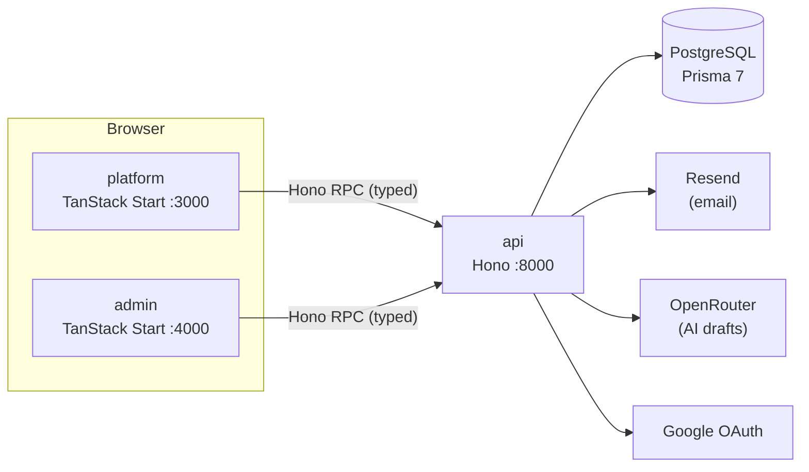

# Pipeline — a solo outreach tracker

[](https://github.com/wahyukurnwn/solo-outreach-pipeline/actions/workflows/deployment.yaml)


A lightweight pipeline for people doing outreach alone: track prospects through stages, never miss a follow-up, and read **honest** conversion numbers. It also drafts a first message from what you already know about each prospect.

**Live demo:** https://app.wahyukurnwn.com/demo — read-only sample data, no sign-up needed.


> **What this project is.** A full-stack case study built end to end by one person: product idea, data model, API, three frontends, auth, tests, and deployment. It is **not** a validated startup — see [Limitations](#limitations-and-what-i-would-do-next). The interesting part is less the feature list than the decisions behind it, so those are written down [below](#engineering-decisions).

---

## Features

**Pipeline**
- Prospects with six stages (New → Contacted → Replied → Call scheduled → Closed Won / Closed Lost) and four channels (Email, LinkedIn, Phone, Other).
- Follow-up dates, with a dashboard card for what is due today or overdue.
- Activity log per prospect (sent / replied / no response), editable and deletable.
- Analytics computed on the fly: response rate, conversion rate, per-channel breakdown, stage distribution.

**AI drafting**
- One click drafts a short outreach message from the prospect's name, company, channel, stage and notes. It is stateless: the text is poured into the activity form, and nothing is stored unless you save the activity.

**Accounts and security**
- Email + password and Google sign-in; forgot / reset password by email; change or remove a password; unlink Google.
- Short-lived access token plus a rotating refresh token in an `httpOnly` cookie, with server-side revocation on sign-out.
- Per-IP rate limiting on sign-up, sign-in and forgot-password; per-user rate limiting on AI drafts.

**Admin console** (separate app)
- List and search users, promote or demote roles, and choose which account powers the public demo.
- Every role change and demo-flag change is written to an audit log (who changed whose, from what, to what, when).

**Public read-only demo**
- `/demo` shows the whole product with sample data, without an account.

## Architecture



pnpm monorepo:

```
apps/
  api/        Hono + Prisma + Zod — modules per domain (auth, prospect, activity, analytics, admin, demo, draft)
  platform/   The product: landing page, auth, dashboard, prospects, analytics, settings, public demo
  admin/      Admin console (separate origin, separate session)
packages/
  ui/         Shared design system (Tailwind v4 tokens, Button, Card, Dialog, Badge, StatCard, …)
```

The frontends import the API's `AppType` and call it through Hono's RPC client, so request and response types are inferred from the real route definitions — there is no hand-written client and no code generation step.

## Engineering decisions

These are the parts I would want to talk through in a review.

**Analytics are derived, never stored.** Response and conversion rates are computed from the activity log on every request, so there is no aggregate table that can drift out of sync. Definitions are explicit: *response rate* = prospects that replied ÷ prospects with at least one activity; *conversion rate* = Closed Won prospects that were actually contacted ÷ prospects contacted (so it cannot exceed 100% because someone marked a deal Won without logging outreach). With nothing contacted the UI shows "—", not "0%", and a note appears while the sample is small.

**Access is scoped by ownership, and answers with 404.** Another user's prospect returns 404 rather than 403, so the API does not confirm that the resource exists.

**Auth without a session store, but with revocation.** Access tokens live 15 minutes. A refresh token (random, stored only as a SHA-256 hash) lives 30 days in an `httpOnly`, `SameSite=Lax` cookie scoped to `/api/auth`, and is **rotated on every use**: the old one is revoked immediately, so a stolen token replayed after the owner refreshes is rejected. On the client, concurrent 401s share a single in-flight refresh; without that, two parallel refreshes would race the rotation and log the user out.

**Google OAuth never puts a JWT in a URL.** The callback issues a single-use, 60-second exchange code; the frontend trades it for a token over a POST.

**Password reset does not leak who has an account.** The response is identical for known and unknown emails. The reset link is built server-side from a trusted `app → origin + path` map, not from the request's `Origin` header, so the email cannot be tricked into pointing at another domain.

**Invariants live in the service layer and in transactions.** An account must always keep at least one way to sign in (you cannot remove your last one). At most one account is the public demo; flagging a new one clears the old one in the same transaction, and audit-log rows are written in that transaction too, so the trail cannot lose an entry. No-op changes are not logged.

**The public demo cannot be pointed at other users.** `/api/demo/*` resolves the single `is_demo` account on the server and never accepts a user id from the client.

**Dates are date-only on purpose.** Follow-up and activity dates are stored as `DATE` and formatted in UTC. Due-ness is decided against the user's *local* date (sent by the client), which fixed an off-by-one where a follow-up due "today" stayed hidden for the first hours of the day in UTC+ timezones.

**AI drafting is stateless and cost-aware.** No `ai_drafts` table: generate, review, use or discard. The provider call has a 30s timeout with the SDK's default retries **disabled** (its default is exponential backoff for up to an hour, which would defeat the timeout and burn the free quota). Provider failures — including a free provider answering HTTP 200 with an error in the body — map to clear 503s instead of a generic 500, while the real cause is logged. Drafts are rate-limited **per user, not per IP**, because the cost attaches to the account.

**The prompt is told not to make things up.** It's built only from the prospect's stored fields plus its last 3 activities (date, channel, outcome, a trimmed excerpt of the message), and it ends with an explicit instruction not to invent outcomes, prior conversations, numbers or promises that aren't in that data — and to write something short and generic instead of filling gaps with fiction. The UI also warns before generating a draft for a prospect with no notes yet, since that's exactly the case where a model is most tempted to fabricate.

**Tests never touch the dev database.** The suite runs against a derived `<db>_test` database that is created and migrated automatically, and a setup file refuses to run against any database whose name does not end in `_test`. This exists because an earlier version silently cleared the demo flag on the real demo account on every run.

**Privacy in the UI.** The sidebar shows only the local part of the email; account settings shows it masked (`joh*****@example.com`).

## Tech stack

| Area | Choices |
|---|---|
| API | Hono 4, Prisma 7 (`pg` driver adapter), PostgreSQL, Zod 4, bcrypt, `jsonwebtoken`, `@hono/oauth-providers` |
| Frontend | TanStack Start / Router / Query, React 19, Tailwind CSS v4, react-hot-toast, lucide-react |
| Shared | pnpm workspaces, TypeScript, Hono RPC types, `@mycustom/ui` design system |
| Integrations | Resend (email), OpenRouter SDK (AI), Google OAuth |
| Quality | Vitest (integration tests against a real Postgres), Biome, Husky pre-commit lint |

## Getting started

**Prerequisites:** Node.js 24 (developed on 24.14), pnpm 10, Docker.

```bash
git clone https://github.com/wahyukurnwn/solo-outreach-pipeline.git
cd solo-outreach-pipeline
pnpm install

# PostgreSQL on localhost:5449
docker compose -f docker-compose.dev.yaml up -d
```

Create your `.env` from the template (all apps read the one in the repository root):

```bash
cp .env.example .env
```

Only `JWT_SECRET` needs a real value to get going (`openssl rand -base64 48`); everything else has a working local default or is optional:

| Variable | Needed for | If empty |
|---|---|---|
| `DATABASE_URL`, `JWT_SECRET`, `CORS_ORIGIN`, `VITE_API_URL` | Running the app | — (defaults in the template work locally) |
| `GOOGLE_CLIENT_ID` / `GOOGLE_CLIENT_SECRET` | "Continue with Google" | That one route answers 503; email + password works |
| `RESEND_API_KEY` / `EMAIL_FROM` | Password-reset emails | Reset links are printed to the API console |
| `OPENROUTER_API_KEY` / `OPENROUTER_MODEL` | "Draft with AI" | Only drafting answers 503 |

`CORS_ORIGIN` lists the frontends, platform first and admin second.

Token and reset lifetimes can be tuned with `ACCESS_TOKEN_EXPIRES_IN_MINUTES` (15), `REFRESH_TOKEN_EXPIRES_IN_DAYS` (30) and `PASSWORD_RESET_TTL_MINUTES` (15).

```bash
pnpm --filter api db:migrate    # apply migrations
pnpm dev                        # api :8000, platform :3000, admin :4000
```

**Google sign-in (optional).** To enable it, create an OAuth client in Google Cloud Console and register `http://localhost:8000/api/auth/callback/google` as an authorized redirect URI. Without credentials the API still boots and everything else works; only the Google route answers 503.

**First admin and the demo account.** There is deliberately no self-service admin sign-up. Sign up in the app, then promote yourself:

```bash
pnpm --filter api db:studio     # or: UPDATE users SET role = 'ADMIN' WHERE email = '…';
```

Sign in again (the role is read from the token), open the admin console at http://localhost:4000, and use **Make demo account** on any user to power `/demo`.

## Testing and quality

```bash
pnpm --filter api test          # 107 integration tests, real Postgres, separate _test database
pnpm lint                       # Biome
pnpm --filter platform exec tsc --noEmit   # likewise for admin and api
```

The tests cover auth (sign-up, sign-in, refresh rotation and replay rejection, logout revocation, Google exchange, reset flow), ownership and 404 behaviour, analytics maths, admin routes and audit logs, the demo endpoints, rate limiting, the mailer, and AI drafting with the provider stubbed at `fetch` level (including timeout and error-mapping paths).

## Deployment

Live at `app.wahyukurnwn.com` / `admin.wahyukurnwn.com` / `api.wahyukurnwn.com`, deployed by `.github/workflows/deployment.yaml` on every push to `main`: lint, type-check and the API's 107 integration tests run first (against a Postgres service container); only then does it build the `api` Docker image (pushed to GHCR as a **private** package, since the VPS authenticates to it with a `docker login`-scoped PAT) and the `platform`/`admin` static bundles, and deploy both.

Only `api` and `db` (PostgreSQL) run as containers, defined in the repository's `docker-compose.yaml` — `platform` and `admin` are prerendered to static files at build time (see [Engineering decisions](#engineering-decisions)) and rsynced straight into place. NGINX and Certbot run on the host, not in a container: they terminate TLS, reverse-proxy `/api/*` to the `api` container, and serve the two static bundles directly from disk (`deploy/nginx.conf` is the reference config, kept in sync with the live VM config). This was a deliberate simplification over an earlier plan that also containerized the frontends and ran a process manager alongside Docker on the VM — one container to deploy instead of three, no PM2, no dual restart mechanisms.

**Cloudflare sits in front of the VM** (DNS proxied, SSL mode Full-strict): the origin IP is hidden and gets baseline DDoS/WAF protection. NGINX trusts Cloudflare's published IP ranges via `ngx_http_realip_module` + `CF-Connecting-IP`, so `$remote_addr` (and the `X-Forwarded-For` the API sees for per-IP rate limiting) is the real visitor IP, not Cloudflare's edge IP.

**Database backups** run as a cron job on the VM: `deploy/backup-db.sh` does a scheduled `pg_dump` (02:00 local time) — PostgreSQL is a container with a named volume, not a managed database, so this is deliberately its own script rather than relying on a provider.

Things the code requires in production:

- **HTTPS, and one site.** The refresh cookie is `Secure` when `NODE_ENV=production`, and it is only sent when the frontends and the API are *same-site* — e.g. `app.example.com`, `admin.example.com` and `api.example.com`. Hosting the API on an unrelated domain will silently break token refresh.
- **`CORS_ORIGIN`** must list every frontend origin; the first is used as the base for password-reset links and the Google callback redirect, the second as the admin origin.
- **`RESEND_API_KEY`** must be set: in production a missing key returns a clear 503 rather than silently dropping the reset email. The sending domain is verified with Resend, so real users (not just the account owner) receive reset and notification emails.
- **`GOOGLE_REDIRECT_URI`** must be set explicitly and registered in Google Cloud Console: behind a reverse proxy that talks plain HTTP to the container, the OAuth library otherwise derives the redirect URI from the incoming request and gets `http://`, causing a `redirect_uri_mismatch`.

## Limitations and what I would do next

Being straightforward about these matters more than a polished feature list:

- **Not validated with real users yet.** The problem statement is an assumption for anyone but the author. Interview questions and onboarding messages for a first round of testers are ready; results aren't in yet.
- **The channel model is Western-outbound-shaped.** There is no WhatsApp channel and no contact-number field, which is where much freelance work in Southeast Asia actually happens. A "send via WhatsApp" action with the AI draft pre-filled would be the most relevant feature to add.
- **No reminders outside the app.** Follow-ups are only visible when you open it; email or push reminders are the missing half of a CRM habit.
- **Single-instance assumptions.** The rate limiter and the OAuth exchange codes are in memory, which is fine for one server and needs Redis (or similar) to scale out.
- **The AI uses a free model.** Latency varies a lot (roughly 5–30 s), there is a daily request quota, and free providers may retain prompts — the UI warns users not to put sensitive data in notes.
- **The role is embedded in the access token**, so a role change applies at the next sign-in or refresh rather than instantly.
- **Session management UI** (list and revoke other devices) is deferred; sign-out revokes only the current session.
- **No browser end-to-end tests**; the frontends are covered by types and the API by integration tests.
- **The UI is English only**, and some code comments and `ERD.md` are written in Indonesian.

## Project notes

- [`ERD.md`](ERD.md) — data model and design principles (DBML, Indonesian).

## License

[ISC](LICENSE)
